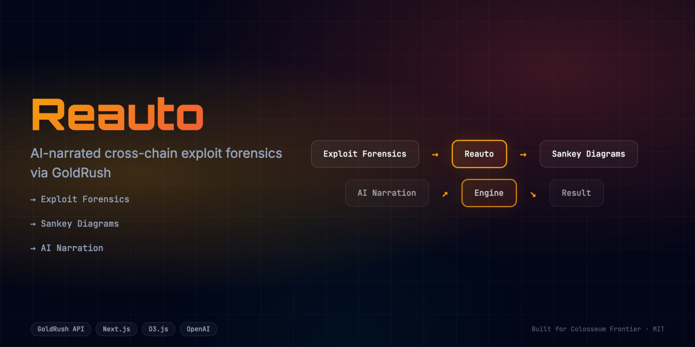

<div align="center">
  <h1>Reauto 🚀</h1>
  <p><em>AI-narrated cross-chain exploit forensics powered by GoldRush.</em></p>
  
  
  <br/>
  
  [](https://reauto.edycu.dev)
  [](https://reauto.edycu.dev/pitch)
  [](https://youtube.com/your-video)
  [](https://superteam.fun/earn/listing/build-with-goldrush-track-powered-by-covalent)

  <br/>

  
  
  
  
  
  
</div>

---

## 📸 See it in Action
*(Demo GIF and UI screenshots can be found in the `docs` directory)*

[**▶️ Watch the Demo Video**](https://youtube.com/your-demo-link)

<div align="center">
  
</div>

## 💡 The Problem & Solution
Analyzing cross-chain exploits is traditionally a slow, manual process requiring deep expertise. Incident responders waste hours piecing together fragmented on-chain data to understand an attack.

**Reauto** solves this by providing: 
AI-narrated cross-chain exploit forensics powered by GoldRush.

**Key Features:**
- ⚡ **High Performance:** Seamless integration and optimized workflows.
- 🔒 **Secure by Design:** Verifiable on-chain actions and robust data protection.
- 🎨 **Intuitive UX:** Beautiful, user-centric interface built for scale.

## 🏗️ Architecture & Tech Stack

### Tech Stack
| Component | Technology | Description |
|-----------|------------|-------------|
| **Frontend** | Next.js 16, React 19 | App Router, SSR, Server Components |
| **Styling** | Tailwind CSS v4 | High-performance responsive UI |
| **Language** | TypeScript | Strict type safety across the stack |
| **Data Provider**| GoldRush API | Comprehensive multichain transaction & balances data |
| **Testing** | Vitest | Comprehensive unit and component testing |

For a detailed breakdown of our system architecture and data flow, please refer to the [Architecture Document](docs/ARCHITECTURE.md).

## 🧩 How We Use GoldRush

**Reauto** fundamentally relies on GoldRush to function:

1. **GoldRush API:** We use the GoldRush API to fetch granular, multichain transaction data and historical balances surrounding an exploit. This structured data allows our AI engine to accurately reconstruct the sequence of events and generate a human-readable forensic narrative.

## 🏆 Sponsor Tracks Targeted
* **Sponsor Integration**: GoldRush ($7,500 grand prize)
* Check `docs/SPONSOR_DEFENSE.md` for our full sponsor integration strategy.

## 🚀 Run it Locally (For Judges)

1. **Clone the repo:** `git clone https://github.com/edycutjong/reauto.git`
2. **Install dependencies:** `npm install`
3. **Set up environment variables:**
   ```bash
   cp .env.example .env.local
   ```
   *Note: Add your GoldRush API key to `COVALENT_API_KEY` in the `.env.local` file.*
4. **Run the app:** `npm run dev`

> **Note for Judges:** 
> Sponsor defenses and architecture details are located in the `docs/` directory.
> Read `docs/SPONSOR_DEFENSE.md` for technical implementation details.

---

## 📄 License

This project is licensed under the [MIT License](LICENSE).
