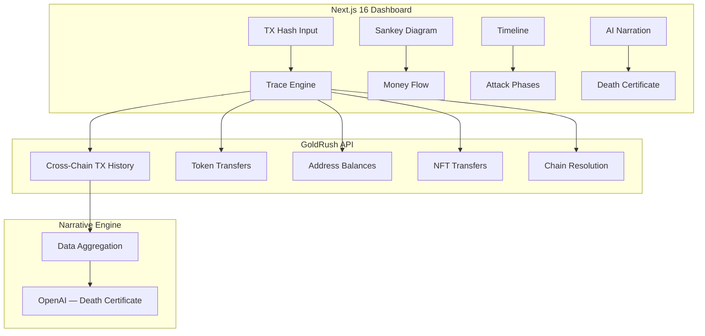

# Reauto — Technical Architecture

## System Architecture



## Tech Stack

| Layer | Technology |
|---|---|
| **Frontend** | Next.js 16, React 19, Tailwind v4 |
| **Data** | GoldRush API (Covalent) |
| **AI** | OpenAI API (narrative generation) |
| **Charts** | Recharts (Sankey, timeline) |
| **Database** | Supabase (cached exploits) |

## GoldRush API Integration Map

| Endpoint | Use Case | Depth |
|---|---|---|
| **Get Transactions** | Fetch full tx history for exploit address | 🟢 Core |
| **Get Token Transfers** | Track stolen token movement across chains | 🟢 Core |
| **Get Balances** | Show before/after balances | 🟢 Core |
| **Cross-Chain Resolution** | Resolve bridged assets across EVM + Solana | 🟢 Deep |
| **NFT Transfers** | Track if NFTs were part of the exploit | 🟡 Supporting |

## Database Schema

```sql
CREATE TABLE exploits (
    id UUID PRIMARY KEY DEFAULT gen_random_uuid(),
    name TEXT NOT NULL,
    initial_tx_hash TEXT NOT NULL,
    chains TEXT[] NOT NULL,
    total_stolen NUMERIC,
    attack_phases JSONB,
    money_flow JSONB,
    ai_narrative TEXT,
    cached_goldrush JSONB,
    created_at TIMESTAMPTZ DEFAULT NOW()
);

CREATE TABLE trace_sessions (
    id UUID PRIMARY KEY DEFAULT gen_random_uuid(),
    input_tx_hash TEXT NOT NULL,
    addresses_traced TEXT[],
    chains_covered TEXT[],
    created_at TIMESTAMPTZ DEFAULT NOW()
);
```

## API Routes

| Method | Path | Description |
|---|---|---|
| POST | `/api/trace` | Input tx hash → GoldRush cross-chain trace |
| GET | `/api/exploits` | List pre-seeded famous exploits |
| GET | `/api/exploits/:id` | Full exploit data + AI narrative |
| POST | `/api/narrative` | Generate AI death certificate |
